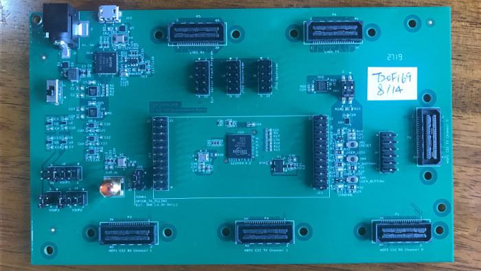

# MIPI_CSI_T20F169
How to design a MIPI CSI interface with Efinix Trion FPGA T20F169 QUICKLY

## 采用Efinix Trion系列FPGA快速设计MIPI接口的摄像头应用

```
.--,       .--,
( (  \.---./  ) )
'.__/o   o\__.'
   {=  ^  =}
    >  -  <
__.""`-------`"".__
/                   \
\ MIPI_CSI_T20F169  /
/                   \
\___________________/
  ___)( )(___
 (((__) (__)))


 ____   ___ ____   ___         ___ ____   ___   __   
|___ \ / _ \___ \ / _ \       / _ \___ \ / _ \ / /_  
  __) | | | |__) | | | |_____| | | |__) | | | | '_ \
 / __/| |_| / __/| |_| |_____| |_| / __/| |_| | (_) |
|_____|\___/_____|\___/       \___/_____|\___/ \___/


```
## Description

> 项目目的：

通过这个项目， 来快速了解如何使用Efinix FPGA内部的HardIP MIPI-CSI快速实现各种不同的image sensor的MIPI接口设计，让过去复杂的， 有难度的设计更加容易快速。 而且确保时序的稳定

Efinix Trion FPGA是第一个集成MIPI CSI 硬核IP的FPGA产品， T20器件有两路MIPI CSI的输入通道， 每个通道支持1.5Gx4 Lanes的全速MIPI CSI Rx， 同是T20器件也具有两路MIPI CSI的输出通道， 每个通道支持1.5Gx4 Lanes的全速MIPI CSI Tx.

今天非常多的AI-SoC已经具有强大的图像处理能力，　例如华为HISI,Rockchip RK 给ARM体系为主的CPU,通过Trion FPGA可以快速接入两路图像Sensor.

以往的设计，　工程师必须采用LVDS的接收以及发送通道模拟MIPI的接口，时序上收敛可能存在风险，　同时设计周期偏长，　因为接受通道还必须设计一定的图像处理缓冲，　并且消耗至少1K-3K的逻辑资源，　而Trion的硬核接口无需消耗这些资源，　立即提供一个ＰＰＰ协议的接口。　


This repo focus on introduction Efinix Trion Series T20 FPGA with HardIP MIPI interface

- README.md  the project readme file
- Efinix 的官网是 www.efinixinc.com


Efinix FPGA 的第一个低成本FPGA家族是 Trion :
- you can register to access the documentation
- we will provide the EVB and software for your evaluation.
- ...


## Trion FPGA Family

```
  T4,T8 configuation multi_image pin is not inside of chip
  T20~T120, the configuation multi_image pin is inside of chip

- FPGA lower than 30mw
  - T4,T8      : 4K , 8K  pure soft logic fabric product
  - Package    : 5x5mm FBGA81, 55 GPIOs
  - EVB        :
    - T8EVB with build in programmer, you only need PC with USB
    - T20MIPIEVB with build in MIPI and High density I/O socket to connect MIPI CSI
-
```

## Software

On Ubuntu 16LTS : Efinix provide the Free FPGA develop suit, you need register it and buy one piece of EVB

```sh

这个案例基于Efinity 2019.3
```
Other features :

- Efinity 2018.4, we use the Version 2018.4 test the project, you can use Efinity 2019.3 or other advanced version

## Hardware

- The Project is based on Efinix T20MIPIEVB, its main features is as follows:

-


## 注册通过后，可以下载芯片手册以及软件资料。

[Efinix Account Register Link](http://www.efinixinc.com/shop/index)

## Project name


- STEP1: install Efinity 2018.4 or other advanced version in Win or Ubuntu
- STEP2: get ready of the T20MIPIEVB,  

    - if you have same EVB with Efinix engieers, with the other words, it is easy to find the issue with same two boards when you need tech support.

- STEP3: download the total repository directory into Efinity project directory, for examples, C:\Efinity\2019.3\project\MIPI_CSI_T20F169

- STEP4: open the Efinity project XML project file

- STEP5: download the FPGA design hex into FPGA, it is all set

- STEP6: the design enclose the ILA module, you can debug it on line

## Documentation

系统中的文档参考了，注册Efinix用户后， 可以下载更加详细的应用指南
在application note目录里有应用解释

- an010-using-internal-reconfiguration-feature-v1.0.pdf（需注册用户）


- Efiniy多镜像原理及用途.pdf  
- T20MIPIEVB.jpg  


- 19-9-9：V1.1

Release第一个版本
功能：
1、MIPI发送
	通过VIO配置MIPI-Rx的工作模式
	通过VIO修改图像参数；
	通过VIO显示自动计算的控制参数，并产生控制信号；
	产生伪随机数据用于和MIPI-Rx对接测试硬件误码；
2、MIPI接收
	通过VIO配置MIPI-Rx的工作模式；
	通过VIO检视MIPI-Rx的工作状态；
	内部自动测量图像参数并通过VIO显示；
	和MIPI-Rx配合测试硬件误码；
3、MIPI-RX波形显示
	通过ILA对MIPI-RX的波形进行显示
4、硬件测试接口
	对MIPI-TX和MIPI-RX的控制信号输出到GPIO，可以通过示波器进行检测；


- 19-9-9：V1.2  

1、添加了MIPIRx的参数（Lanes、VCEn）修改产生复位；

2、添加了MIPITx的参数（Lanes、FrmMode）修改产生复位；

3、增加了MIPI RX复位后对清楚告警功能；

4、增加了MIPITX和MIPIRX上电复位功能；


- 19-09-10: V1.3

1、把Tx和RX的同步信号输出，并锁到管脚	    

2、把Rx和TX的VIO的顺序排列了一下；

3、添加MIPIRxDaTaType到ILA；

4、修改了VIO显示RxDataType的问题；

5、修改了RxReselutionChange一直为高的Bug；

6、修改接收行场消隐的算法，使VIO显示不会有太大波动；

- 19-10-03：V1.4

1、修改了显示的行和列像素值搞反了的Bug；
2、由于MIPI-Tx是在数据全部进入到TxDvaid后才发送数据，所以把TxDvalid的位置放在HSync信号以后；经测试最稳定的位置在600ns范围（刚好是一个EoT-LPS-SoT的时间）；
3、在FramerMode为1时 ，THS-Trail=90ns，如果HSync间隔小于900ns，数据会出错；所以在程序中将HSync信号间隔（HoriBlanking）设置为900ns；
4、由于TxBuff的长度为5760Byte，所以在设置上做了Buffer长度的限制，当设置的行像素长度时，限制有效数据不超过5760字节；否则按5760字节计算；避免演示出错；

3、没有做错误配置的提醒；
4、只支持了收发像素对应的类型的数据检查（如0x24,0x2a等）；没有对其它类型做支持；
5、对VC的支持过于简单；

- 19-10-11：V1.5
1、找到规律并修改了有时候出现VSync短帧丢失的Bug；
2、修改当计算出来的DValid大于HSync的Bug;
3、在计算最大DValid时，交换了计算顺序，先做除法，避免了最后乘积超过17位的情况；
4、重新安排了计算是需要保证的数据的优先级：一、硬件限制；二、保证分辨率；三、保证数据长度；

- 20-02-05：V1.6

1、调整了目录结构，方便开Debuger;
2、完善了SDC


## Project Verilog file list

- helleoworld.v  

每个设计镜像就是改变helloworld.v中的DELAY_SIZE


## Verilog parameter

- CBSEL 就是imag选择的管脚，T4,T8的是将其外接的
- 分别改动如下代码中的**DELAY_SIZE** 为8,10,12,14
- 每次改动重新编译， 生成一个新的hex文件， 在outflow目录下

```verilog

module helloworld (led, clk, rstn);//reverse);
   parameter DELAY_SIZE = 10; //12 in normal, 14 is slow,10 is quick,8 is fast
   parameter WIDTH = 5;

```


## Update

-Feb-4-2020, test all code with Efinity Ver 2019.3.272

 Tester by Ben Chen in Windows, test in T8F81 EVB

 Compiler by Wisdom Zhang in Ubuntu16


## Acknowledge

Project Test by Ben Chen
Project upload by Wisdom Zhang

Anything question: email: 909614802 at qq dot com
```
 _____  __ _       _      
| ____|/ _(_)_ __ (_)_  __
|  _| | |_| | '_ \| \ \/ /
| |___|  _| | | | | |>  <
|_____|_| |_|_| |_|_/_/\_\
```
